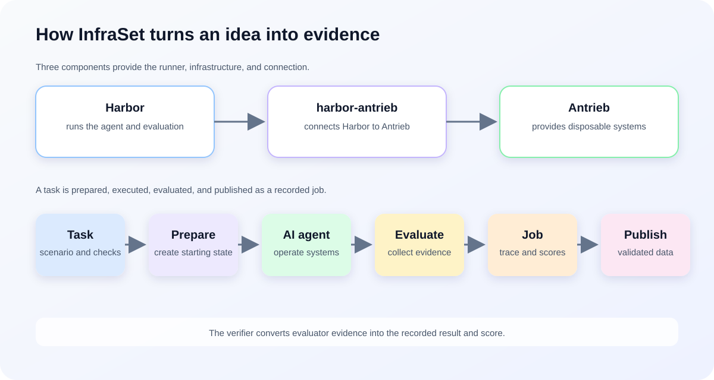

# InfraSet: An Open Dataset of LLM-Executed Infrastructure Tasks

The industry is increasingly using LLMs to operate infrastructure, either directly or with a human in the loop.
Yet there is little public empirical data showing what happens when LLMs operate real systems, whether in
greenfield, brownfield, end-of-life, or distributed environments. Perhaps LLMs perform remarkably well. Perhaps
they fail in subtle ways. We do not yet have enough evidence to know either way.

InfraSet is a dataset of executed infrastructure tasks and traces, created to build that evidence. It currently
contains 42 tasks, and we hope the community will join us and help expand it. Results can also be explored on
[the InfraSet dataset on Hugging Face](https://huggingface.co/datasets/infraset/infraset).

## What makes InfraSet different

- **It is not a leaderboard.** InfraSet explores infrastructure scenarios rather
  than focusing on comparing LLMs.
- **A rich testbed.** It includes multiple operating systems,
  full-system VMs, multi-node clusters, and networked infrastructure.
- **Rich execution data.** It publishes traces of what the LLM attempted, what
  happened, whether it recovered, and whether the result worked—not just scores.

## Testbed

Tasks run on disposable VMs, clusters, and networks provisioned through
[Antrieb](https://antrieb.sh/). A key benefit of Antrieb is the exceptionally
fast provisioning of VM-based testbeds. No access to your infrastructure is
required.

Environments can include:

- Current and end-of-life Linux distributions, including RHEL 7 through 10,
  AlmaLinux 9, Alpine, Arch, Debian 13, Ubuntu 16.04, and Ubuntu 24.04
- Single-node and multi-node systems
- Brownfield configurations and pre-existing state
- Routers, firewalls, and switches, including VyOS, OPNsense, OpenWrt, and SONiC
- Multi-network topologies and real service dependencies

## Execution traces

Published runs include the observable, redacted agent trajectory:

- Agent messages and tool calls
- Commands, output, and errors
- Failed and recovery attempts
- Final response and evaluator result

Each task is evaluated against the resulting infrastructure state, not merely the
LLM's final answer. Browse and download the published traces from the
[InfraSet Hugging Face dataset](https://huggingface.co/datasets/infraset/infraset).

## Running a task

Install `uv` and log in to the agent you want to use, such as Codex or Claude
Code. Create an API key in the [Antrieb dashboard](https://antrieb.sh/dash), then
export the Antrieb token:

```bash
export ANTRIEB_TOKEN='ant_XXXXXX'
```

Run a task from the repository root:

```bash
./run-task.sh ./tasks/greenfield/haproxy-nodejs-ubuntu16
```

The runner fetches Harbor and `harbor-antrieb` automatically. Results are stored
under `jobs/<task-name>/`.

## Creating a task

InfraSet includes a task-builder skill that allows a coding agent to turn a task
idea into a complete executable Harbor task.

1. Copy `./skills/infraset-task-builder` into a skills directory your coding
   agent can access.
2. Load the skill and describe the task you want to create.

For example:

> Create an OpenLDAP task with 50 service accounts used at various times during
> the past eight months. Identify accounts unused for 90 or more days and disable
> them.

The skill generates the task instructions, topology, preparation, and evaluation
files. Run the generated task with:

```bash
./run-task.sh ./tasks/<category>/<generated-task-name>
```

## Exploring results

Task definitions are in the [tasks directory](https://github.com/open-sudo/infraset/tree/main/tasks); execution results are in the [jobs directory](https://github.com/open-sudo/infraset/tree/main/jobs). The same
results are published in the [InfraSet Hugging Face dataset](https://huggingface.co/datasets/infraset/infraset),
which is the easiest place to browse or download them. Use your preferred
analysis tool to investigate:

- How are LLMs performing on version X of your distribution?
- Which system components are most LLM-friendly?
- What did the LLM try first?
- Which assumptions were incorrect?
- Where did it recover successfully?
- Did the final change actually solve the problem?
- What would a human SRE need to verify before applying the fix?

## Contributing

Contributions may include task definitions, environment configurations,
preparation and evaluation code, execution traces, result artifacts, and
accompanying analysis.

InfraSet reviews the task and evaluator, validates submitted traces, reproduces
executions when necessary, and calculates published metrics from the validated
artifacts. Contributor-reported results remain provisional until this process
is complete.

## How InfraSet Works

### Architecture

InfraSet combines three components:

- **Harbor** runs the AI agent, records its trace, and coordinates evaluation.
- **Antrieb** provides disposable VMs, clusters, and networks.
- **harbor-antrieb** connects Harbor to Antrieb.

### Concepts

- A **task** defines the scenario, environment, preparation, and checks.
- A **job** is one recorded execution of a task.
- The **preparer** creates the starting state before the agent runs.
- The **evaluator** tests the resulting infrastructure and collects evidence.
- The **verifier** turns that evidence into recorded results and scores.

### Workflow



An idea becomes a task, Harbor runs it in an Antrieb environment, and the
resulting job is evaluated, recorded, validated, and published in the
[InfraSet dataset on Hugging Face](https://huggingface.co/datasets/infraset/infraset).
