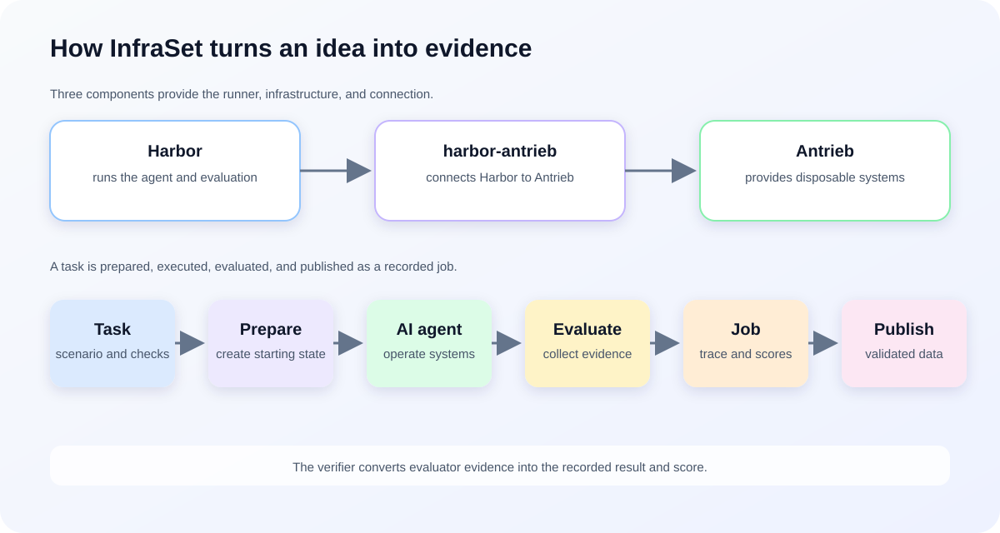

# InfraSet: An Open Dataset of LLM-Executed Infrastructure Tasks

The industry is increasingly using LLMs to operate infrastructure, either directly or with a human in the loop.
Yet there is little public empirical data showing what happens when LLMs operate real systems, whether in
greenfield, brownfield, end-of-life, or distributed environments. Perhaps LLMs perform remarkably well. Perhaps
they fail in subtle ways. We do not yet have enough evidence to know either way.

InfraSet is a dataset of executed infrastructure tasks and traces, created to build that evidence. We invite the
community to join us and help expand it. Results can also be explored on
[the InfraSet dataset on Hugging Face](https://huggingface.co/datasets/infraset/infraset).

## What makes InfraSet different

- **It is not a leaderboard.** InfraSet explores infrastructure scenarios rather
  than focusing on comparing LLMs.
- **A rich testbed.** It includes multiple operating systems,
  full-system VMs, multi-node clusters, and networked infrastructure.
- **Rich execution data.** It publishes traces of what the LLM attempted, what
  happened, whether it recovered, and whether the result worked.

## Testbed

Tasks run on disposable VMs, clusters, and networks provisioned through
[Antrieb](https://antrieb.sh/). A key benefit of Antrieb is the exceptionally
fast provisioning of VM-based testbeds. No access to your infrastructure is
required.

Environments can include:

- Current and end-of-life Linux distributions, including RHEL 7 through 10,
  AlmaLinux 9, Alpine, Arch, CentOS Stream 10, Debian 13, Ubuntu 16.04, and
  Ubuntu 24.04
- Single-node and multi-node systems
- Brownfield configurations and pre-existing state
- Routers, firewalls, and switches, including VyOS, OPNsense, OpenWrt, and SONiC
- Multi-network topologies and real service dependencies

## Execution traces

Published runs include the recorded agent trajectory:

- Agent messages and tool calls
- Commands, output, and errors
- Failed and recovery attempts
- Fixed system snapshots before preparation, after preparation, and after execution
- Final response and verifier result

Each task is evaluated from evidence captured during execution: the complete
command trace and outputs, preparation baselines, and fixed system snapshots
taken before preparation, after preparation, and after execution. The LLM's
final response is not evidence by itself. Browse and download the published traces from the
[InfraSet Hugging Face dataset](https://huggingface.co/datasets/infraset/infraset).
The `runs` dataset configuration provides one row per LLM run, the `commands`
configuration provides one row per command the LLM issued, and the `tasks`
configuration provides the task definitions and instructions.

Performance accounting begins once the LLM is started for a task. A run passes
only when every functional requirement was met. Every other LLM run fails,
including a run in which the LLM started but issued no command. Attempts that end
because of failures in the surrounding test system are classified as platform
failures and excluded from LLM performance.

Dataset maintainers regenerate the queryable tables and Hugging Face card after
changing recorded jobs with:

```bash
uv run --with pyarrow python3 scripts/build_hf_dataset.py
python3 scripts/generate_hf_card.py
uv run --with pyarrow python3 scripts/validate_hf_dataset.py \
  --card docs/hf-dataset-card.md
```

## Usage modes

InfraSet works at three levels, depending on whether you want to mine the data or
produce more of it. Only the last two need an account anywhere.

### Mode 1: mine the traces

Download the dataset and analyse it with whatever you like: pandas, DuckDB, your
own agent, Claude Code. The command records ship as Parquet alongside the raw job
tree, so you can start from a table or from the original artifacts.

```python
from datasets import load_dataset
commands = load_dataset("infraset/infraset", "commands")
```

**Requires nothing.** No API key, no configuration, no execution. Everything the
findings rest on is already published.

### Mode 2: run tasks on community images

Execute tasks live to capture new traces. Antrieb provisions the cluster, Harbor
drives the run, and the results land under a scenario ID and timestamp below `jobs/`.
This covers Alpine, AlmaLinux, CentOS Stream, Ubuntu, and the four network
platforms: VyOS, OpenWrt, SONiC and OPNsense.

**Requires an Antrieb API key** for the provisioning and lifecycle loop. Antrieb
is free to use; create a key in the [dashboard](https://antrieb.sh/dash).

### Mode 3: run tasks on RHEL

The same thing against RHEL 7.9, 9.8 and 10.0, which is where the generational
comparisons come from. These images register with Red Hat Subscription Manager on
boot, so they need an account of your own.

**Requires a free Antrieb API key and a free Red Hat account.** Register at
[developers.redhat.com](https://developers.redhat.com), then put the same username
and password in `$HOME/credentials.env` as `REDHAT_USERNAME` and
`REDHAT_PASSWORD`. Without them the nodes cannot register, and the run fails
before the task starts.

## Task variant metadata

Each task includes a searchable `variant.toml` descriptor. See the
[metadata schema and index commands](docs/variant-metadata.md) for use-case keys,
language and OS fields, prompt fingerprints, and scenario IDs.

## Running a task

Install `uv` and log in to the agent you want to use, such as Codex or Claude
Code. Create an API key in the [Antrieb dashboard](https://antrieb.sh/dash), then
create `$HOME/credentials.env`:

```dotenv
ANTRIEB_TOKEN=ant_XXXXXX
REDHAT_USERNAME=your-red-hat-username
REDHAT_PASSWORD=your-red-hat-password
```

The Red Hat entries are needed only for tasks that initialize subscribed RHEL
systems, and a free account from
[developers.redhat.com](https://developers.redhat.com) is enough. Protect the file
before running tasks:

```bash
chmod 600 "$HOME/credentials.env"
```

Run a task or a whole scenario from the repository root:

```bash
./run-task.sh --transport direct ./tasks/5469/centralized-log-collector-bash-rhel7-5469
./run-task.sh --transport trentina ./tasks/5782
```

Each collection has its own persistent scenario ID; see the
[scenario directory](tasks/README.md). Tasks live at
`tasks/<id>/<usecase>-<language>-<os>-<id>/`. The runner inherits the ID from the
scenario folder. There is no `--id` option or per-execution ID generation.

Use `--transport trentina` for the local Trentina gateway or `--transport direct`
for direct Antrieb execution. Executor mode defaults to interactive; use
`--mode batch` to group compatible changes into non-interactive Bash scripts:

```bash
./run-task.sh --transport direct --mode batch ./tasks/5469
```

Set `CREDENTIALS_FILE` to use a different credential-file path. The runner fetches
Harbor and `harbor-antrieb` automatically. New results are stored under
`jobs/<id>/<timestamp>/<usecase>-<language>-<os>-<id>/`; timestamps preserve rerun history.
Existing jobs use this same layout. Each timestamp folder contains the jobs for
that scenario and run; scenario IDs are also recorded in each `variant.toml`.

## Creating a task

InfraSet includes a task-builder skill that allows a coding agent to turn a task
idea into a complete executable Harbor task.

1. Copy `./skills/infraset-task-builder` into a skills directory your coding
   agent can access.
2. Load the skill and describe the task you want to create.

For example:

> Create an OpenLDAP task with 50 service accounts used at various times during
> the past eight months. Identify accounts unused for 90 or more days and disable
> them.

The skill generates the task instructions, topology, preparation, and evaluation
files. Run the generated task with:

```bash
./run-task.sh ./tasks/<id>/<usecase>-<language>-<os>-<id>
```

## Exploring results

The generated [job index](jobs/INDEX.md) lists every job by scenario and batch,
with OS, language, execution settings, status, attempts, revisions, and links to saved artifacts.
`run-task.sh` refreshes it when jobs start and finish, including failed and
interrupted runs. Rebuild it manually with
`python3.11 scripts/generate_job_index.py`. Do not edit the index by hand.

Task definitions are in the [tasks directory](https://github.com/open-sudo/infraset/tree/main/tasks); execution results are in the [jobs directory](https://github.com/open-sudo/infraset/tree/main/jobs). The same
results are published in the [InfraSet Hugging Face dataset](https://huggingface.co/datasets/infraset/infraset),
which is the easiest place to browse or download them.

The [metrics directory](metrics) mirrors `jobs/<scenario-id>/<timestamp>/`.
Each timestamp folder contains category and provisioning reports for that exact
execution, with links to the source jobs. Scenario-level comparisons live directly
under `metrics/<scenario-id>/`. Explicit `--aggregate` reports are also stored at
scenario level with an `aggregate-` prefix; they combine runs and may mix execution
settings. Use timestamped reports when comparing transports or models.

Use your preferred analysis tool to investigate:

- How are LLMs performing on version X of your distribution?
- Which system components are most LLM-friendly?
- What did the LLM try first?
- Which assumptions were incorrect?
- Where did it recover successfully?
- Did the final change actually solve the problem?
- What would a human SRE need to verify before applying the fix?

## How InfraSet Works

### Architecture

InfraSet combines three components:

- [**Harbor**](https://github.com/harbor-framework/harbor) provides the
  execution framework and records the agent trace.
- [**Antrieb**](https://antrieb.sh) provides disposable VMs, clusters, and
  networks.
- [**harbor-antrieb**](https://github.com/open-sudo/harbor-antrieb) connects
  Harbor to Antrieb.

### Concepts

- A **task** defines the scenario, requested outcome, environment, and optional
  preparation.
- A **job** is one recorded execution of a task.
- The **preparer** creates the starting state, including brownfield data or
  configuration drift.
- The **collector** records the same bounded system observations before
  preparation, after preparation, and after execution. If no preparer runs, the
  first two boundaries are represented by one snapshot.
- The **executor** coordinates Harbor, Antrieb, and the AI agent while recording
  commands and final evidence.
- The **verifier** evaluates the captured evidence and fixed before-and-after system
  observations. It has no live system access.

### Workflow



An idea becomes a task, the preparer creates its starting state, and the
executor runs it in an Antrieb environment. The collector records each lifecycle
boundary, and the verifier evaluates those snapshots and the executor evidence
before the resulting job is recorded, validated, and published in the
[InfraSet dataset on Hugging Face](https://huggingface.co/datasets/infraset/infraset).

## Contributing

We warmly welcome contributions, including new operating systems, network
topologies, clustered environments, brownfield scenarios, troubleshooting
tasks, evaluation improvements, execution traces, result artifacts, and
accompanying analysis.

InfraSet reviews the task and evidence, validates submitted traces, reproduces
executions when necessary, and calculates published metrics from the validated
artifacts.
